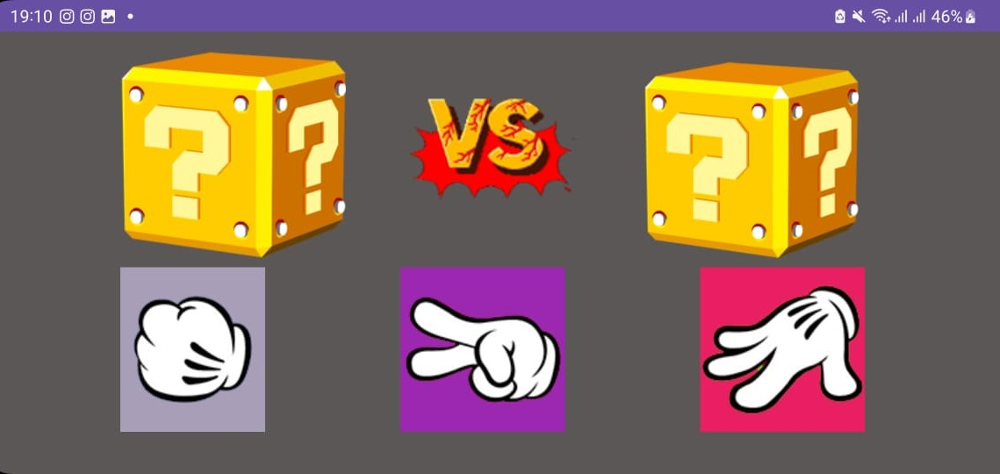
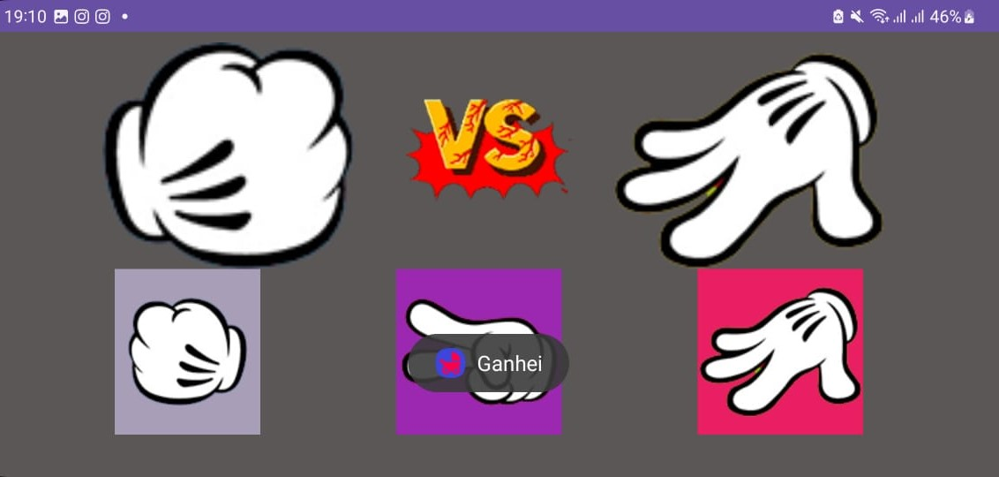

#

**O Jogo**
O "Jogo" é uma implementação simples do clássico jogo "Pedra, Papel e Tesoura" para dispositivos Android. Os jogadores fazem suas escolhas entre pedra, papel e tesoura, e o aplicativo gera uma jogada aleatória para o oponente. As escolhas são exibidas com animações visuais e acompanhadas por efeitos sonoros. O resultado do jogo é determinado pelas regras tradicionais do jogo, com mensagens exibidas para indicar se o jogador ganhou, perdeu ou empatou.

**Funcionalidades Principais:**
1. **Interface Gráfica:**
   - Utiliza elementos como `ImageView` para representar as escolhas dos jogadores.
   - Botões (`ImageButton`) para cada opção do jogador (Pedra, Papel, Tesoura).

2. **Animações e Efeitos Sonoros:**
   - Utiliza animações visuais (`AlphaAnimation`) para mostrar e esconder as escolhas do oponente.
   - Efeitos sonoros (`MediaPlayer`) são reproduzidos ao tocar nos botões.

3. **Lógica do Jogo:**
   - A lógica do jogo é implementada nos métodos `sorteioJogoInimigo` e `verificaJogada`.
   - Gera uma jogada aleatória para o oponente e compara as escolhas dos jogadores para determinar o vencedor.

4. **Interação com o Usuário:**
   - As escolhas do jogador são realizadas através de botões interativos.
   - Mensagens de Toast informam o resultado do jogo (Empate, Vitória, Derrota).

5. **Ciclo de Vida do Aplicativo:**
   - Implementa métodos `onCreate` e `onDestroy` para configurar elementos iniciais e gerenciar a reprodução de sons.

**Aspectos Adicionais:**
   - O aplicativo demonstra o uso de recursos gráficos, animações e efeitos sonoros para tornar a experiência do usuário mais envolvente.
   - É uma implementação lúdica e simples do jogo "Pedra, Papel e Tesoura" com funcionalidades básicas de interação e feedback ao usuário.

   ---
   

   ---

   Agradeço ao [Professor Douglas](linkedin.com/in/douglas-dos-reis-3473a868) pela oportunidade de desenvolver 📱 este aplicativo de forma divertida e dinâmica em sala de aula. Essa experiência agregou significativamente ao meu conhecimento, enriquecendo a minha jornada de aprendizado. 🙏🚀

